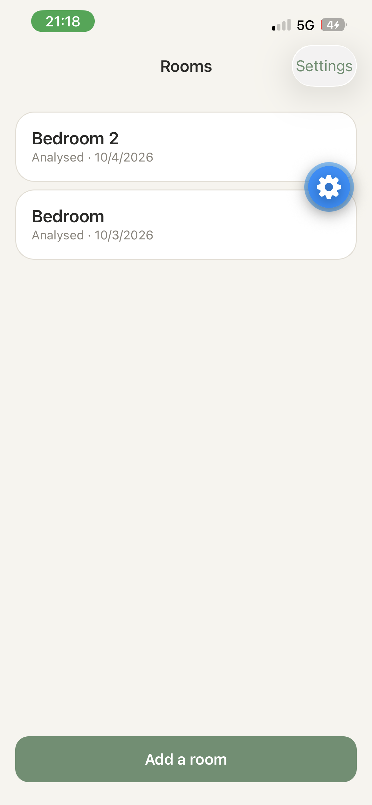
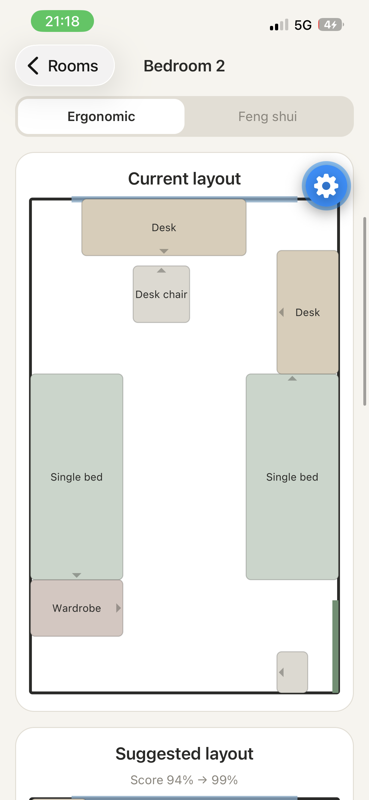
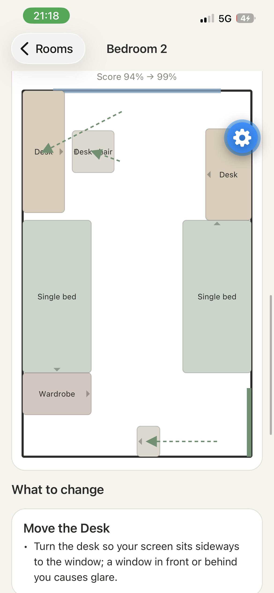
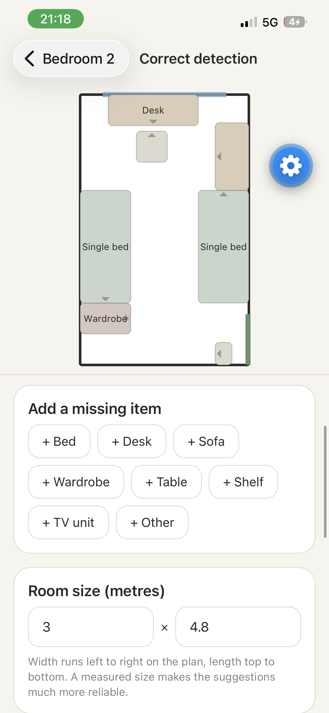
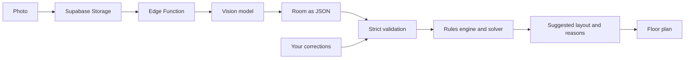

# Roomwise

Photograph a room and get a calmer layout. Roomwise analyses a photo of your room, then suggests
a furniture arrangement based on **ergonomic** or **feng shui** principles. The result is shown as
a top-down floor plan with a plain-language reason for every move.

> Semester project, built to be demo-ready. See [ROADMAP.md](ROADMAP.md) for the plan and
> [docs/RULES.md](docs/RULES.md) for the guidelines behind the suggestions.

## Screenshots

|                   Rooms                   |                     Analysis                      |                      Suggestion                      |                 Correct detection                  |
| :---------------------------------------: | :-----------------------------------------------: | :--------------------------------------------------: | :------------------------------------------------: |
|  |  |  |  |

## What it does

- **Photo to floor plan.** A vision model reads the photo and returns room size, doors, windows
  and furniture, drawn as a top-down plan.
- **Two ways of arranging.** Ergonomic (clear walkways, no window glare on screens, space beside
  the bed) or feng shui (headboard against a wall, bed not in line with the door).
- **Explained suggestions.** Every move comes with the reason for it, and the score before and
  after.
- **Minimal change.** A room that is already good is left alone. Heavy items such as beds only
  move for a clear gain, and a desk chair moves together with its desk.
- **You stay in control.** A correction screen lets you fix whatever the AI got wrong: rename,
  move, turn or resize items, add missing ones, enter the real room size, and place doors and
  windows. Suggestions update from your corrections.
- **Saved per account.** Rooms, photos, corrected layouts and saved arrangements live in your own
  private space.

## How it works



Two deliberate layers:

1. **Perception (AI).** A vision model turns the photo into structured JSON. Its output is treated
   as untrusted: it is validated and clamped (`src/domain/validate.ts`) before anything uses it.
2. **Rules engine (our code).** Deterministic rules score a layout from 0 to 1, and a solver
   searches for a better one. It is explainable, repeatable and unit-tested, and it works offline.

Why not let the AI suggest the layout directly? A model can describe a room well, but its
arrangement advice changes from run to run and cannot be tested. Splitting the two layers means the
suggestions are reproducible and every one can be traced to a named rule.

### Design decisions

- **Minimal-change solver.** Placement candidates include "stay where you are", and moving costs
  score, more so for beds and wardrobes. Moves that fix a real problem (a blocked door, window
  glare) are always kept; small gains are dropped.
- **Corrections beat guesses.** A single photo cannot give exact geometry, so users can correct
  the detection and enter the real room size. Corrections are stored as the room's layout.
- **Privacy by default.** Photos sit in a private bucket, one folder per user, and every table is
  protected by Row Level Security.

## Tech stack

| Layer   | Choice                                                        |
| ------- | ------------------------------------------------------------- |
| App     | React Native + Expo (TypeScript, strict), Expo Router         |
| Drawing | react-native-svg                                              |
| Backend | Supabase: Postgres, Auth, Storage, Edge Functions (Deno)      |
| AI      | Anthropic Messages API, called only from the Edge Function    |
| Quality | ESLint, Prettier, Jest, GitHub Actions CI, Row Level Security |

## Getting started

Prerequisites: Node 22, a free [Supabase](https://supabase.com) project, an Anthropic API key,
and the Expo Go app on your phone.

```bash
npm install
cp .env.example .env          # then fill in your Supabase URL and publishable key
npx expo start                # scan the QR code with Expo Go
```

Backend setup (once):

```bash
npx supabase login
npx supabase link --project-ref <your-project-ref>
npx supabase db push                                   # applies supabase/migrations
npx supabase secrets set ANTHROPIC_API_KEY=sk-ant-...  # server-side only
npx supabase functions deploy analyze-room
```

In the Supabase dashboard, under Authentication, turn off "Confirm email" while developing.

## Scripts

| Command             | What it does                                             |
| ------------------- | -------------------------------------------------------- |
| `npm test`          | Unit tests for the domain layer (rules, solver, editing) |
| `npm run lint`      | ESLint                                                   |
| `npm run typecheck` | TypeScript strict check                                  |
| `npm run format`    | Prettier                                                 |

Every push runs format check, lint, typecheck and tests in GitHub Actions.

## Project structure

```
app/                  Screens (Expo Router): rooms, capture, room detail, correction, settings
src/domain/           Pure logic: types, geometry, rules, solver, editing, validation (+ tests)
src/components/       FloorPlan (SVG) and small UI primitives
src/lib/              Supabase client, API layer, auth
src/theme/            Colours, spacing, typography
supabase/migrations/  Database schema + Row Level Security
supabase/functions/   analyze-room Edge Function and its prompt
```

## Security notes

- The AI API key exists only as a Supabase secret; the app never sees it.
- Every table has Row Level Security; storage is a private bucket scoped per user folder.
- The Edge Function runs queries as the calling user and rate-limits analyses per hour.
- Model output is validated and clamped before it reaches any logic or UI.

## Limitations

- Geometry from a single photo is approximate, and the same photo can be read slightly
  differently each time. That is why the correction screen and the room-size field exist.
- The solver is a heuristic: it finds good arrangements, not provably optimal ones.
- Suggestions are general guidelines, not professional design advice.

## Development note

Built as a solo student project with AI assistance (Claude, by Anthropic) for code generation and
review. The author ran, tested and directed all of it.
