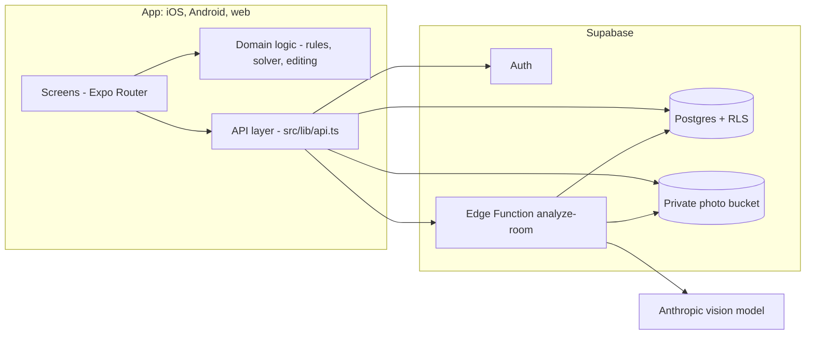

# Architecture

## Overview

The app runs on iOS and Android through Expo and also as a website built from the same code.

## Two layers

1. **Perception (AI).** The Edge Function sends one to four photos to a vision model and asks for a
   JSON description: room size, doors, windows and furniture with positions and orientation.
2. **Rules engine (our code).** `src/domain` scores a layout with named rules and a solver searches
   for a better layout. It is deterministic, unit-tested and runs on the device.

The model's output is never used directly. `parseRoomAnalysis` validates and clamps it first, and
the user can correct any mistake on the correction screen. The corrected layout is then what the
solver works on.

## Request flow: analysing a room

1. The app resizes each photo (max width 1400 px) and uploads it to `room-photos/<user_id>/...`.
2. The app creates a `rooms` row (main photo path, up to three extra paths).
3. The app calls the `analyze-room` Edge Function with the room id and the user's token.
4. The function checks the token and the rate limit, loads the room and downloads the photos **as
   the user** (so RLS applies), calls the model, and stores the JSON on the room row.
5. The app validates the JSON, runs the rules engine and draws the floor plan.

## Data model

| Table          | Purpose                                                                                |
| -------------- | -------------------------------------------------------------------------------------- |
| `rooms`        | One row per room: name, photo paths, optional measured size, analysis JSON, confidence |
| `arrangements` | Saved suggestions: mode, layout, list of moves, score before and after                 |
| `preferences`  | Per-user default mode and units                                                        |

All three are protected by Row Level Security; see [SECURITY.md](SECURITY.md).

## Domain layer (`src/domain`)

| File          | Role                                                                           |
| ------------- | ------------------------------------------------------------------------------ |
| `types.ts`    | Room, item, opening and layout types. Coordinates in cm, origin top-left.      |
| `geometry.ts` | Footprints, overlap, distances, door and window zones                          |
| `rules/`      | Scoring rules, see [RULES.md](RULES.md)                                        |
| `solver.ts`   | Candidate placements, scoring, move costs, minimal-change selection            |
| `edit.ts`     | Correction screen operations: move, resize, add, remove, with collision checks |
| `validate.ts` | Parsing and clamping of untrusted AI output                                    |

### How the solver decides

- For each movable item it generates candidates: back against a wall, floating positions on a grid,
  beside a bed, next to a sofa or bed for side tables.
- Each candidate is scored by the rules; moving costs score (more for heavy items such as beds and
  wardrobes), so small gains are dropped and a good room stays unchanged.
- Two strategies are compared (a greedy pass and a gentle pass from the original positions); the
  gentler one wins unless the greedy one is clearly better.
- A final guard never returns a layout that scores lower than the current one.

## Decisions and trade-offs

| Decision                                 | Why                                                                                                                      | Cost                                                             |
| ---------------------------------------- | ------------------------------------------------------------------------------------------------------------------------ | ---------------------------------------------------------------- |
| AI describes, rules decide               | Suggestions are repeatable, testable and explainable                                                                     | Layout quality depends on how well the model reads the photo     |
| Minimal-change solver                    | Users do not want their whole room rearranged                                                                            | Some possible improvements are skipped on purpose                |
| Correction screen                        | One photo cannot give exact geometry                                                                                     | Extra step for the user                                          |
| Supabase (RLS, Auth, Storage, Functions) | One service for the whole backend, security rules live in the database                                                   | Tied to one provider                                             |
| Web build on GitHub Pages                | Expo Go no longer opens other accounts' projects (policy change, May 2026); a web link works for any friend on any phone | Slightly different look and camera behaviour than the native app |

## Build and delivery

- **CI** (GitHub Actions): format check, lint, typecheck and tests on every push.
- **Web deploy** (GitHub Actions): `expo export --platform web`, published to GitHub Pages after each
  push to `main`.
- **Native updates:** EAS Update (preview channel) for the owner's own Expo Go.
